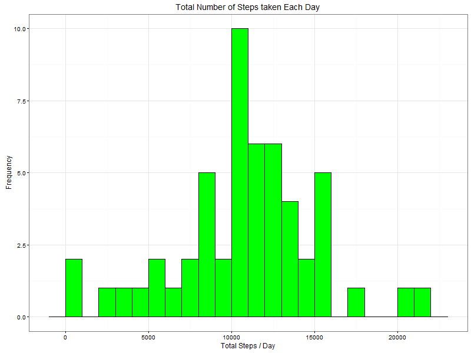
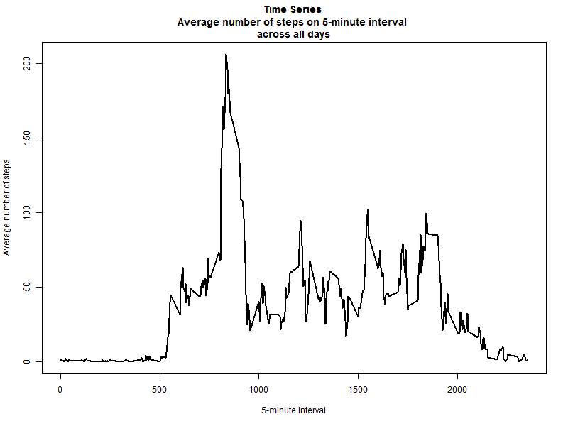
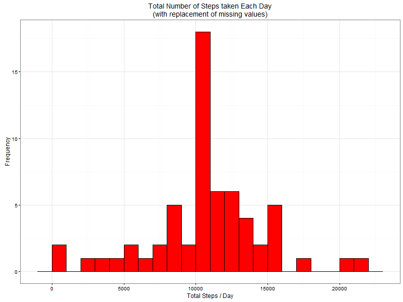
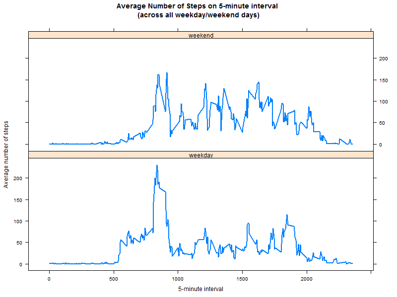

# Reproducible Research : Assignment_1
Christopher H. Lyman  

## Introduction

This assignment makes use of data from a personal activity monitoring device. This device collects data at 5 minute intervals through out the day. The data consists of two months of data from an anonymous individual collected during the months of October and November, 2012 and include the number of steps taken in 5 minute intervals each day.  

The data for this assignment can be downloaded from the course web site:  

* Dataset: [Activity monitoring data](https://d396qusza40orc.cloudfront.net/repdata%2Fdata%2Factivity.zip)[52K]

The variables included in this dataset are:

* ```steps```: Number of steps taking in a 5-minute interval (missing values are coded as NA)
* ```date```: The date on which the measurement was taken in YYYY-MM-DD format
* ```interval```: Identifier for the 5-minute interval in which measurement was taken 

The dataset is stored in a comma-separated-value (CSV) file and there are a total of 17,568 observations in this dataset.

## Loading and Preprocessing  
Show any code that is needed to  

1. **Load the data (i.e. ```read.csv()```)**  

```r
# Create Data repo
if(!dir.exists('./Data')){dir.create('./Data')}

# Create Figures repo
if(!dir.exists('./Figures')){dir.create('./Figures')}

# Load data
if(!file.exists('./Data/activity.csv')){
fileUrl<- 'https://d396qusza40orc.cloudfront.net/repdata%2Fdata%2Factivity.zip'
download.file(fileUrl,destfile='./Data/activity.zip',mode = 'wb')
unzip('./Data/activity.zip')
}

activity <- read.csv('activity.csv')

# Structure of the data
str(activity)
```

```
## 'data.frame':	17568 obs. of  3 variables:
##  $ steps   : int  NA NA NA NA NA NA NA NA NA NA ...
##  $ date    : Factor w/ 61 levels "2012-10-01","2012-10-02",..: 1 1 1 1 1 1 1 1 1 1 ...
##  $ interval: int  0 5 10 15 20 25 30 35 40 45 ...
```

2. **Process/transform the data (if necessary) into a format suitable for your analysis**


```r
# Date variables are formatted   
require(lubridate)
```

```
## Loading required package: lubridate
```

```r
activity$date<-ymd(activity$date)
str(activity$date)
```

```
##  POSIXct[1:17568], format: "2012-10-01" "2012-10-01" "2012-10-01" "2012-10-01" ...
```

## What is mean total number of steps taken per day ?  
For this part of the assignment, you can ignore the missing values in the dataset.

1. **Calculate the total number of steps taken per day** 


```r
require(dplyr)
```

```
## Loading required package: dplyr
```

```
## 
## Attaching package: 'dplyr'
```

```
## The following objects are masked from 'package:lubridate':
## 
##     intersect, setdiff, union
```

```
## The following objects are masked from 'package:stats':
## 
##     filter, lag
```

```
## The following objects are masked from 'package:base':
## 
##     intersect, setdiff, setequal, union
```

```r
# Ignore missing values and group by date 
byDate<- na.omit(activity) %>% group_by(date)
# Summarize the total steps per day (totalSteps)
totalSteps<-byDate %>% summarize(stepsSum = sum(steps))
head(totalSteps)
```

```
## Source: local data frame [6 x 2]
## 
##         date stepsSum
##       (time)    (int)
## 1 2012-10-02      126
## 2 2012-10-03    11352
## 3 2012-10-04    12116
## 4 2012-10-05    13294
## 5 2012-10-06    15420
## 6 2012-10-07    11015
```

2. **If you do not understand the difference between a histogram and a barplot, research the difference between them. Make a histogram of the total number of steps taken each day**


```r
par(mfrow = c(1,1))
require(ggplot2)
```

```
## Loading required package: ggplot2
```

```r
# Histogram of the total number of steps taken each day

png('./Figures/figure1.png',width=800,height=600)

ggplot(totalSteps,aes(x=stepsSum))+
  geom_histogram(binwidth=1000,fill='green',col='black')+
  ggtitle('Total Number of Steps taken Each Day')+ylab('Frequency')+xlab('Total Steps / Day')+
  theme_bw()

dev.off()
```

```
## png 
##   2
```

 

3. **Calculate and report the mean and median of the total number of steps taken per day**


```r
#  Mean and median of the total number of steps taken per day
summarize(totalSteps,stepsSumMean=mean(stepsSum),stepsSumMedian=median(stepsSum))
```

```
## Source: local data frame [1 x 2]
## 
##   stepsSumMean stepsSumMedian
##          (dbl)          (int)
## 1     10766.19          10765
```

## What is the average daily activity pattern ?  

1. **Make a time series plot (i.e. ```type = "l"```) of the 5-minute interval (x-axis) and the average number of steps taken, averaged across all days (y-axis)**

```r
# Ignore missing values and group by date 
byInterval<-na.omit(activity) %>% group_by(interval)
# Summarize the average steps per 5-minute interval (stepsAvg)
stepsAvg<-byInterval%>%summarize(stepsMean=mean(steps))
head(stepsAvg)
```

```
## Source: local data frame [6 x 2]
## 
##   interval stepsMean
##      (int)     (dbl)
## 1        0 1.7169811
## 2        5 0.3396226
## 3       10 0.1320755
## 4       15 0.1509434
## 5       20 0.0754717
## 6       25 2.0943396
```

```r
png('./Figures/figure2.png',width=800,height=600)

plot(x=stepsAvg$interval,y=stepsAvg$stepsMean,type = 'l',
     main = 'Time Series \nAverage number of steps on 5-minute interval \nacross all days',
     xlab = '5-minute interval',ylab = 'Average number of steps',lwd=2)

dev.off()
```

```
## png 
##   2
```

 

2. **Which 5-minute interval, on average across all the days in the dataset, contains the maximum number of steps ?**

```r
# Arrange stepsAvg by "stepsMean" values descending and take the top "interval" 
arrange(stepsAvg,desc(stepsMean))[1,1]
```

```
## Source: local data frame [1 x 1]
## 
##   interval
##      (int)
## 1      835
```

**Observations:** From the above, the maximum daily activity comes at 8.35am ($835^{th}$ of 5 minute interval). 

## Imputing missing values  
Note that there are a number of days/intervals where there are missing values (coded as ```NA```). The presence of missing days may introduce bias into some calculations or summaries of the data. In this section:

1. **Calculate and report the total number of missing values in the dataset (i.e. the total number of rows with ```NA```s)**

```r
sum(is.na(activity)) 
```

```
## [1] 2304
```

**Observations:** There are 2304 missing values in the dataset.
 
2. **Devise a strategy for filling in all of the missing values in the dataset. The strategy does not need to be sophisticated. For example, you could use the mean/median for that day, or the mean for that 5-minute interval, etc** 

**Note:** Here we use the average number of steps of each 5-minute interval (from the above ```stepsAvg``` subset data) to replace missing values.

3. **Create a new dataset that is equal to the original dataset but with the missing data filled in**


```r
# Find the unique interval  
h<-unique(activity$interval)

for(i in h){
  # Find row index (Indx) according to "interval" and "steps" conditions
  Indx<-with(activity,which(interval==i & is.na(steps)))
  # Assign the "steps" average value
  activity[Indx,'steps']<-stepsAvg$stepsMean[stepsAvg$interval==i]
}
# Check if Nas 
sum(is.na(activity))
```

```
## [1] 0
```

4. **Make a histogram of the total number of steps taken each day and Calculate and report the ```mean``` and ```median``` total number of steps taken per day. Do these values differ from the estimates from the first part of the assignment ? What is the impact of imputing missing data on the estimates of the total daily number of steps ?**


```r
# Group by date   
byDate<- activity %>% group_by(date)
# Summarize the total steps per day (totalSteps)
totalSteps<-byDate %>% summarize(stepsSum= sum(steps))
head(totalSteps)
```

```
## Source: local data frame [6 x 2]
## 
##         date stepsSum
##       (time)    (dbl)
## 1 2012-10-01 10766.19
## 2 2012-10-02   126.00
## 3 2012-10-03 11352.00
## 4 2012-10-04 12116.00
## 5 2012-10-05 13294.00
## 6 2012-10-06 15420.00
```

```r
# Histogram of the total number of steps taken each day

png('./Figures/figure3.png',width=800,height=600)

ggplot(totalSteps,aes(x=stepsSum))+
  geom_histogram(binwidth=1000,fill='red',col='black')+
  ggtitle('Total Number of Steps taken Each Day\n(with replacement of missing values)')+
  ylab('Frequency')+xlab('Total Steps / Day')+
  theme_bw()

dev.off()
```

```
## png 
##   2
```

 


```r
#  Mean and median of the total number of steps taken per day 
summarize(totalSteps,stepsSumMean_New=mean(stepsSum),stepsSumMedian_New=median(stepsSum))
```

```
## Source: local data frame [1 x 2]
## 
##   stepsSumMean_New stepsSumMedian_New
##              (dbl)              (dbl)
## 1         10766.19           10766.19
```

**Observations:** From the above, we can see that the average of total steps/day (with imputing missing data) is similar from the first part of this project (by omitting missing data). However, the median becomes equal to the mean due the replacement of missing data with their average values of these total steps. Indeed, here more data with average values are considered (as shown the histogramm plot), such as the median goes toward to the mean value of total steps/day.  

## Are there differences in activity patterns between weekdays and weekends ?  
For this part the ```weekdays()``` function may be of some help here. Use the dataset with the filled-in missing values for this part.

1. **Create a new factor variable in the dataset with two levels - "weekday" and "weekend" indicating whether a given date is a weekday or weekend day**


```r
# Assign days according to dates to new colum "week""
activity<-activity%>% mutate(week=wday(date,label=T))
# Assign "weekdays" or "weekend"according days
activity$week<-with(activity,ifelse(week %in% c('Sat','Sun'),'weekend','weekday'))
# Class factor for the variable "week"
activity$week <- factor(activity$week)
str(activity$week)
```

```
##  Factor w/ 2 levels "weekday","weekend": 1 1 1 1 1 1 1 1 1 1 ...
```

2. **Make a panel plot containing a time series plot (i.e. ```type = "l"```) of the 5-minute interval (x-axis) and the average number of steps taken, averaged across all weekday days or weekend days (y-axis). See the README file in the GitHub repository to see an example of what this plot should look like using simulated data**


```r
# Group by week and interval   
by_week_interval<- activity %>% group_by(week,interval)
# Summarize the total steps per day (stepsAvg)
stepsAvg<-by_week_interval%>%summarize(stepsMean=mean(steps))
head(stepsAvg)
```

```
## Source: local data frame [6 x 3]
## Groups: week [1]
## 
##      week interval  stepsMean
##    (fctr)    (int)      (dbl)
## 1 weekday        0 2.25115304
## 2 weekday        5 0.44528302
## 3 weekday       10 0.17316562
## 4 weekday       15 0.19790356
## 5 weekday       20 0.09895178
## 6 weekday       25 1.59035639
```

```r
# Plot 
require(lattice)
```

```
## Loading required package: lattice
```

```r
png('./Figures/figure4.png',width=800,height=600)

xyplot(stepsMean ~ interval | week, data=stepsAvg, type="l", lwd=2, layout=c(1,2), 
       xlab = "5-minute interval", ylab = "Average number of steps",
       main = "Average Number of Steps on 5-minute interval \n(across all weekday/weekend days)")

dev.off()
```

```
## png 
##   2
```

 

**Observations:** We can see from the above plots that the person seems to be generally more active on weekend days. 

## Conclusions

In this project, a data set is analysed with a step by step approach. This data was first dowloaded and transformed to evaluate influence of missing data. A strategy is proposed to evaluate missing data by considering average values. Exploratory data analysis is obtained via statistics and plots. This project is reproducible and was done with R-Studio (version 0.99.491) on Windows 10.  
